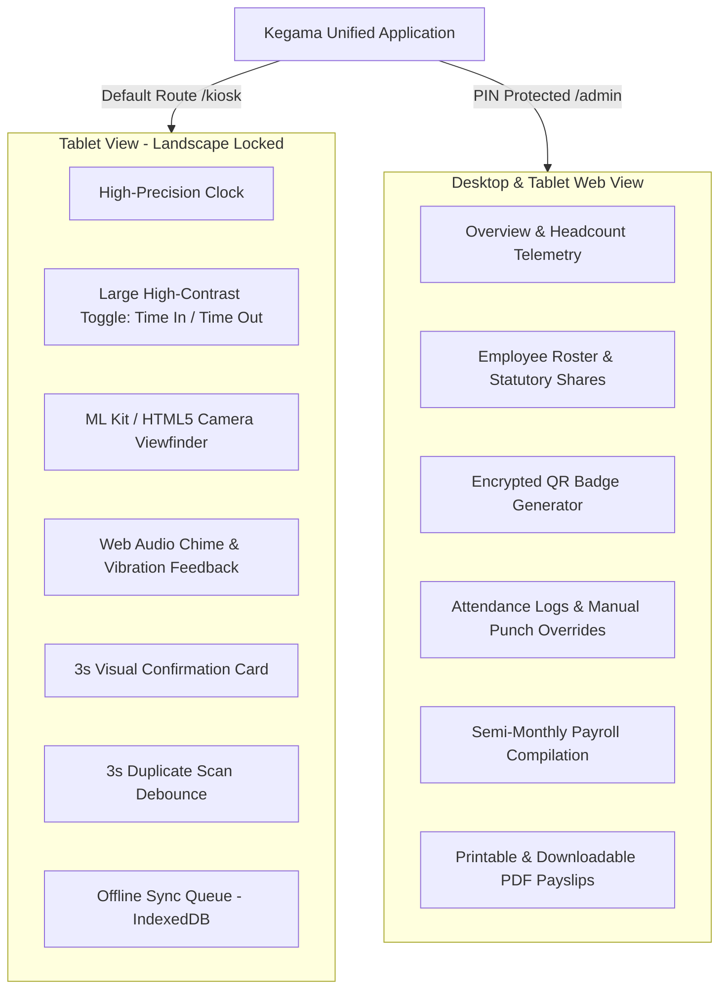

# Kegama Attendance & Payroll Kiosk System

A unified, offline-first attendance recording and semi-monthly payroll compilation system built with **Vue 3**, **Vite**, **TypeScript**, **Tailwind CSS**, and **Capacitor CLI** targeting landscape Android tablets and management desktops.

---

## 📱 System Architecture & Operational Modes

Instead of maintaining two disparate applications, the codebase is architected into two seamlessly integrated operational modes:



### 1. Kiosk / Scanner Mode (`/kiosk`)
- **Landscape Viewport Optimization**: Designed for wall-mounted or desktop stand tablets with Android manifest orientation lock (`android:screenOrientation="sensorLandscape"`).
- **Viewfinder & Camera Support**: Integrates `@capacitor-mlkit/barcode-scanning` for native Android devices with an automatic fallback to `html5-qrcode` for browsers, webviews, and PWA mode.
- **Auditory & Haptic Feedback**: Dual-tone synthesized Web Audio API chords (uplifting high chime for TIME_IN, resonant chord for TIME_OUT, alert tone for invalid badges) plus device vibration.
- **Visual Confirmation Card**: 3-second temporary card showing worker photo, name, employee ID, timestamp, and shift status before smoothly returning to standby.
- **3-Second Debounce Protection**: Prevents duplicate records if an employee lingers before the camera.
- **Quick Test Simulator**: Built-in dropdown simulator to test punch flows on any headless device without a physical webcam.

### 2. Admin / Payroll Portal Mode (`/admin`)
- **Password & PIN Protection**: Secure access requiring supervisor 4-digit PIN (default: `1234`) or administrator password (default: `admin123`).
- **Employee Roster**: Manages job titles, departments, daily and monthly basic rates, statutory employee shares (SSS, PhilHealth, Pag-IBIG), cash advance/loan balances, and shift types.
- **Digital QR Pass Generator**: Generates cryptographically signed, tamper-resistant QR passes with printable CR80 ID badge layouts.
- **Attendance & Missed Punch Resolution**: Flags unpaired punches with warning tags (`⚠️ Missing Out / Unpaired`) and enables supervisors to approve manual end times.
- **Semi-Monthly Payroll Engine**: Automatically aggregates 15-day cutoffs (1st–15th or 16th–End of Month), computes tardiness/undertime, deducts half-shares for statutory contributions, and exports official PDF payslips.

---

## 🗄️ Database Schema Design (IndexedDB via Dexie)

The local device memory uses **Dexie.js** IndexedDB with three core tables plus an offline synchronization queue:

### 1. `employees`
| Field | Type | Description |
|---|---|---|
| `id` | `string` (PK) | Unique ID (e.g., `KR-001`) |
| `fullName` | `string` | Worker legal name |
| `jobTitle` | `string` | Role / designation |
| `department` | `string` | Operations, Maintenance, Security, Warehouse, etc. |
| `dailyRate` | `number` | Daily wage rate (PHP) |
| `monthlyBasicRate`| `number` | Monthly base rate (PHP) |
| `sssShare` | `number` | Monthly employee statutory share (halved per cutoff) |
| `philHealthShare` | `number` | Monthly employee statutory share (halved per cutoff) |
| `pagIbigShare` | `number` | Monthly employee statutory share (halved per cutoff) |
| `shiftType` | `'regular' \| 'night' \| 'flexible'` | Work schedule classification |
| `shiftStart` | `string` | Scheduled start (e.g. `08:00` or `22:00`) |
| `shiftEnd` | `string` | Scheduled end (e.g. `17:00` or `06:00`) |
| `loanBalance` | `number` | Outstanding cash advance / loan amortization balance |
| `status` | `'active' \| 'inactive'` | Employment status |

### 2. `attendanceLogs`
| Field | Type | Description |
|---|---|---|
| `id` | `string` (PK) | Auto-ID (e.g. `LOG-KL203-912`) |
| `employeeId` | `string` (Index) | Reference to Employee ID |
| `logType` | `'TIME_IN' \| 'TIME_OUT'` | Punch classification |
| `timestamp` | `string` | ISO 8601 timestamp |
| `manualOverride` | `boolean` | Flag set to `true` when edited or created by supervisor |
| `supervisorNote` | `string` | Justification note for audit trail |
| `synced` | `boolean` | Sync confirmation status |
| `deviceId` | `string` | Device identifier (e.g. `KIOSK-TABLET-01`) |

### 3. `payrollCutoffs`
| Field | Type | Description |
|---|---|---|
| `id` | `string` (PK) | Cutoff key (e.g. `CUTOFF-2026-09-01-to-2026-09-15`) |
| `cutoffName` | `string` | E.g. "Sept 1 – Sept 15, 2026 (1st Half)" |
| `startDate` | `string` | `YYYY-MM-DD` |
| `endDate` | `string` | `YYYY-MM-DD` |
| `totalGross` | `number` | Sum of all gross earnings in cutoff |
| `totalDeductions`| `number` | Sum of statutory and loan deductions |
| `totalNet` | `number` | Final take-home disbursement |
| `items` | `CutoffSummaryItem[]` | Itemized calculations per employee |

### 4. `syncQueue` (Offline Resilience Queue)
| Field | Type | Description |
|---|---|---|
| `id` | `string` (PK) | Sync transaction ID |
| `logId` | `string` | Associated `AttendanceLog` ID |
| `payload` | `AttendanceLog` | Full punch object |
| `createdAt` | `string` | ISO timestamp |
| `status` | `'pending' \| 'synced' \| 'failed'` | Cloud sync transmission state |

---

## 🌙 Attendance & Payroll Edge Cases Handled

### 1. Night Shifts & Midnight Crossover
- **Problem**: Workers starting at 10:00 PM (22:00) on Day 1 clock out at 6:00 AM (06:00) the following morning on Day 2. Standard systems mistakenly consider these two separate days, resulting in broken shifts.
- **Solution**: The `pairEmployeeShifts` engine checks the time delta between `TIME_IN` and subsequent `TIME_OUT`. If the duration is within a 16-hour window and spans across midnight, it binds them into a single valid shift attributed to Day 1, flags `isMidnightCrossover = true`, calculates correct net working hours, and applies overnight tardiness rules.

### 2. Missed Punches & Unpaired Swipes
- **Problem**: Employees occasionally forget to clock out before leaving.
- **Solution**:
  - The engine detects unpaired punches (isolated `TIME_IN` without `TIME_OUT` or orphan `TIME_OUT`).
  - Flags the shift with `status: 'missing_out'` and a prominent warning tag.
  - The Admin Attendance view highlights these records with a **"Resolve / Approve Punch"** button.
  - Supervisors specify the approved end time and an audit reason (`manualOverride = true`).

### 3. Offline Handling & Sync Queue
- **Problem**: Kiosk tablet Wi-Fi drops while workers are scanning badges.
- **Solution**:
  - Punches are **always committed locally to IndexedDB device memory first**.
  - If the device is offline, a sync queue item is created with status `pending`.
  - The Kiosk UI displays an amber status badge: `Offline (X queued)`.
  - As soon as the `online` window event fires (or when supervisor taps "Sync"), the background worker pushes queued punches to the remote store and marks them `synced: true`.

---

## 🚀 Running the Project

### Development Server
```bash
npm install
npm run dev
```

### Run Verification Test Suite
```bash
npx tsx scripts/verify-system.ts
```

### Production Web Build
```bash
npm run build
```

### Sync Native Android Platform
```bash
npx cap sync android
```

### Open in Android Studio
```bash
npx cap open android
```

---

## 🔐 Credentials for Demo / Testing
- **Supervisor PIN**: `1234` (or `0000`)
- **Administrator Password**: `admin123`

